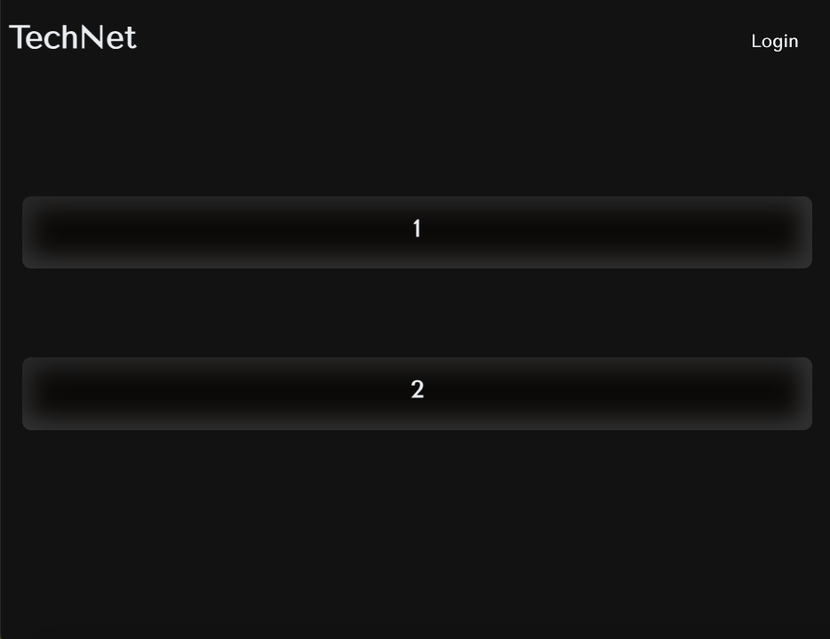
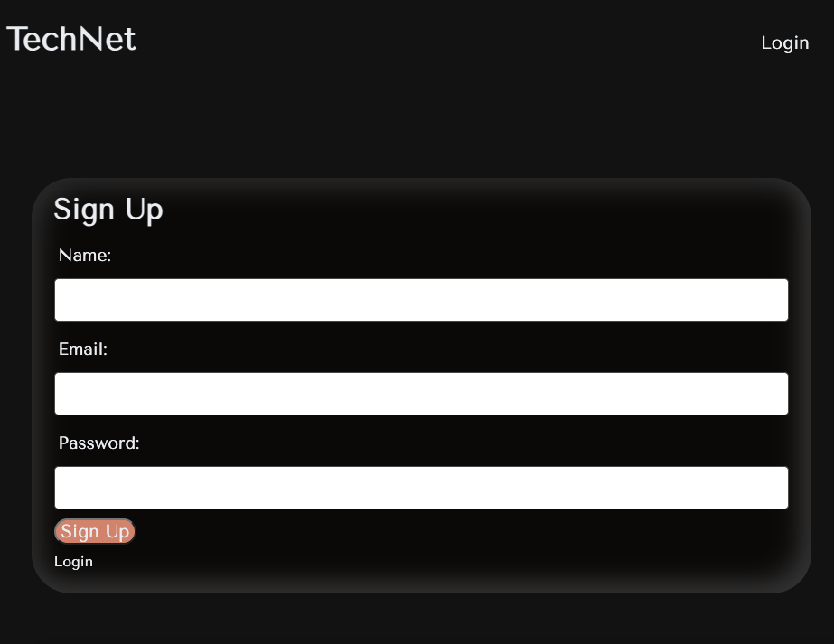
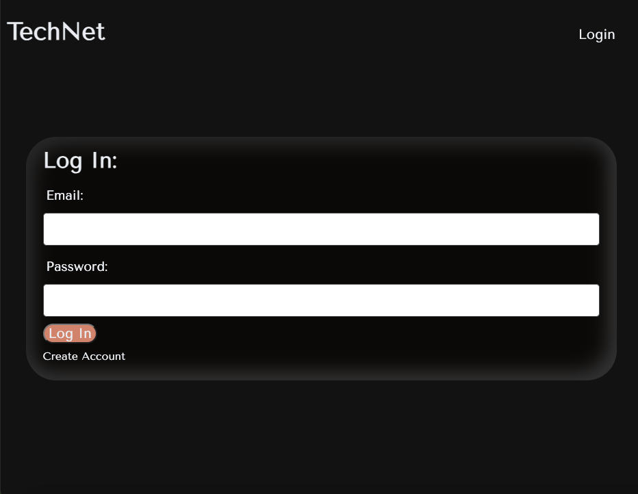
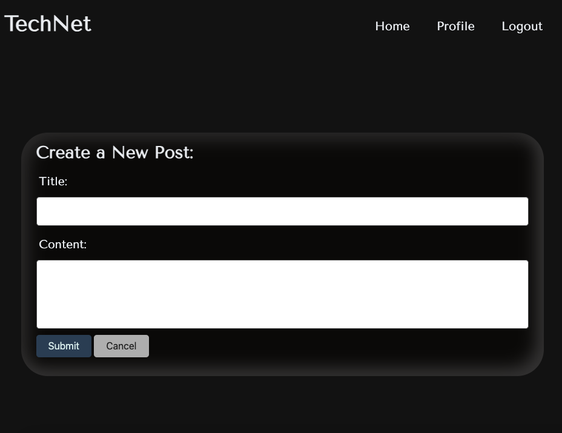
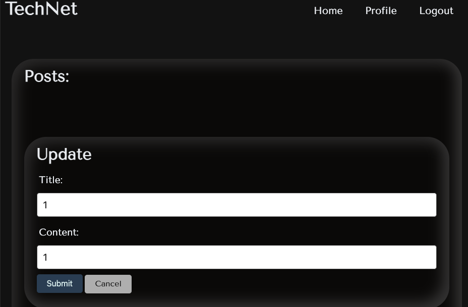
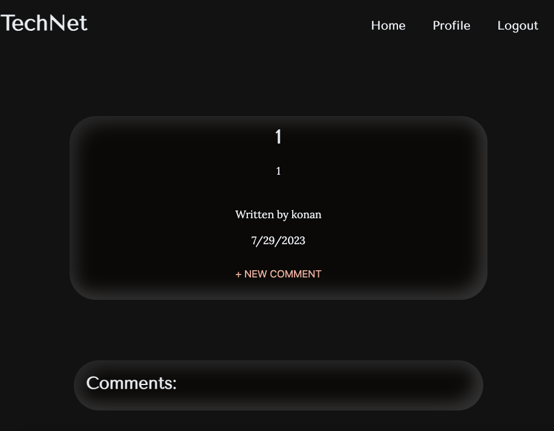
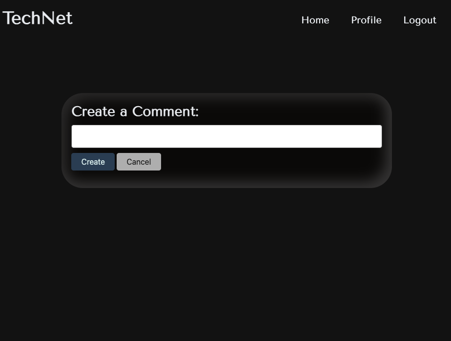

# TechNet

## Description:
TechNet is a CMS-style blog site similar to a Wordpress site, where developers can publish their blog posts and comment on other developers’ posts as well.

## Table of Contents

- [Description](#description)
- [Usage](#usage)
- [Demonstration](#demonstration)
- [Contributions](#contributions)
- [Links](#links)
- [Technologies](technologies)
- [License](#license)

## Usage:

**Interface**: Please visit TechNet using the Heroku link. 

**User**: As a user of TechNet you can:
- Create an account
- Log into your account
- Create blog posts
- Update blogposts
- Delete blogposts
- View others blogposts
- Comment on blogposts 
- View your blogpost page dashboard
- Logout

## Demonstration:

1. **Home Page** 

2. **Create an Account** 

3. **Log into your Account**

4. **Create a Blogpost** 

5. **Update a Blogpost**

6. **View a Single Post** 

6. **Comment on a Blogpost** 

## Contributions: 

Contributions to TechNet are welcome! If you have any improvements, bug fixes, or new features to add, feel free to submit a pull request.

To contribute to TechNet, please follow these steps:

1. Fork the repository.
2. Create a new branch for your feature or bug fix.
3. Make your changes in the new branch.
4. Commit your changes, providing a descriptive commit message.
5. Push your branch to your forked repository.
6. Open a pull request against the main repository.
7. Provide a clear and concise description of your changes in the pull request.
8. Submit the pull request and wait for feedback or further instructions.

Please note that by submitting a pull request, you agree to allow the project maintainers to license your work under the project's existing license.

Thank you for considering contributing to Bits and Bytes. Your contributions are highly appreciated!

## Links: 
- Repository: https://github.com/kemcclen/TechNet
- Deployed Application: https://technet-0016a9aebc4f.herokuapp.com/

## Technologies

- Node.js and Express.js to create a RESTful API
- Handlebars.js as the template engine
- MySQL and the Sequelize ORM for the database.
- Express-session authentication
- ENV environment variable protection 
- MVC file structure
- Heroku
- [Neumorphism.io](https://neumorphism.io/#e0e0e0) for CSS cards 
- [uiverse.io](https://uiverse.io/buttons) for buttons 

## License:
TechNet is licensed under the [MIT License](https://opensource.org/license/mit/).

_The MIT License is a permissive open-source license that allows you to use, modify, and distribute the project for both commercial and non-commercial purposes. It provides you with the freedom to customize the application to suit your needs._

_By contributing to TechNet, you agree that your contributions will be licensed under the same MIT License. This ensures that the project remains open-source and accessible to the community._
